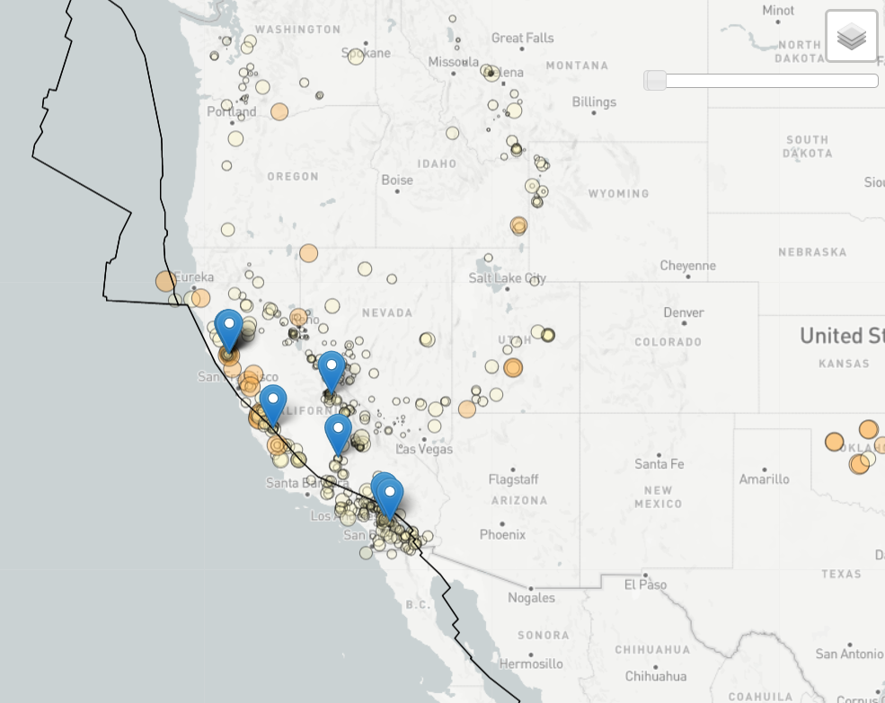

## Unit 15 | Leaflet.js library plus one plugin 

Skills - JavaScript, Leaflet.js library

This project demonstrates the use of a Leaflet javascript library.  To build a map using the USGS geojson coordinates, listing all of the earthquakes in a given week.  In addition to pinpointing the location of the earthquakes, color and size of the circle markers are designated to the magnitude of each earthquake.  As a plugin, the leaflet.slider was used, developed by dwilhelm89 via his GitHub repo.  The plugin does not play the timecourse, instead it markers the timecourse as the user slides the slider control.

____________________________________________________________________________________________________________________________________________________________________________________________

__________________________________________________________________________________________________________________________________________________________________________